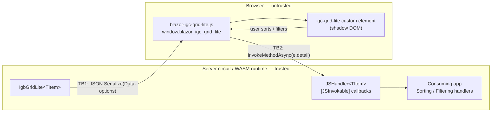

# Threat model — IgniteUI.Blazor.GridLite

| | |
|---|---|
| **Status** | Draft — awaiting maintainer review |
| **Package in scope** | `IgniteUI.Blazor.GridLite` (net8.0 / net9.0 / net10.0) |
| **Repository** | https://github.com/IgniteUI/IgniteUI.Blazor.GridLite |
| **Reviewed commit** | <!-- TODO(maintainer): SHA at time of sign-off --> |
| **Document owner** | <!-- TODO(maintainer): name --> |
| **Last updated** | 2026-08-11 |
| **Method** | STRIDE per trust boundary |

## 1. Why this document exists

This document records the package's security boundaries, assumptions, threats, controls, and accepted risks. It is a **living document** and must be updated whenever the JS interop surface, serialization boundary, bundled JavaScript, or release process changes.

It is not a penetration test, not an audit, and not an attestation of security.

## 2. Scope

**In scope**

- The `IgniteUI.Blazor.GridLite` NuGet package: managed code under `src/IgniteUI.Blazor.GridLite/`.
- The static web asset it ships: `wwwroot/js/blazor-igc-grid-lite.js` (Vite bundle of `igc-grid-lite-entry.js` and the `igniteui-grid-lite` npm package).
- The build and release pipeline that produces and signs the package.

**Out of scope**

- The consuming application (its authentication, authorization, CSP, data access).
- Internal implementation of the upstream `igniteui-grid-lite` npm package, except for its behavior at the rendering boundary (see TM-DOM-01).
- The ASP.NET Core Blazor framework itself. Framework-level behavior is treated as an assumption (§5).
- The demo application under `demo/`.

## 3. Architecture and trust boundaries

The two package-specific trust boundaries are:

- **TB1 — server → client.** Everything crossing it is visible to the end user, forever.
- **TB2 — client → server.** In Blazor Server, callback data originates in the browser and must be treated as untrusted input. In Blazor WebAssembly, it remains client-controlled but does not cross into a server circuit.

## 4. Assets and security objectives

| Asset | Objective |
|---|---|
| Consumer data bound to `Data` (`IEnumerable<TItem>`) | Confidentiality — only intended serializable properties reach the browser |
| The Blazor circuit (server-side rendering) | Availability — a client cannot exhaust CPU/memory |
| The consuming app's browser origin | Integrity — the component never introduces script execution |
| The published NuGet package | Integrity — signed, reproducible, no unintended content |

## 5. Assumptions and consumer responsibilities

The model is only valid if these assumptions hold. Consumer-facing responsibilities must be documented where they affect secure use of the package.

| # | Assumption |
|---|---|
| A1 | The consuming app enforces authentication/authorization; the grid performs none. |
| A2 | The consuming app enforces a Content Security Policy appropriate to its render mode. |
| A3 | The consuming app prevents untrusted script execution. The component must avoid introducing script execution and avoid unnecessarily widening access available to other scripts running in the same origin. |
| A4 | Data bound to `Data` has already passed the app's own authorization filter. |
| A5 | `IgbGridLiteOptions.JavascriptPath` is a compile-time constant controlled by the app, never derived from user input or untrusted configuration. |
| A6 | Blazor Server hosts retain appropriate SignalR message-size and circuit resource limits. Applications that increase those limits must reassess TM-IX-03. |

## 6. Threats

Severity is the residual severity **given** assumptions A1–A6. Status values are `Open`, `Mitigated`, `Proposed acceptance`, `Accepted`, and `Verified — no finding`. A proposed acceptance becomes accepted only after a completed review records its justification and approver.

### TB2 — client → server (JS interop callbacks)

| ID | Threat | STRIDE | Sev | Status |
|---|---|---|---|---|
| **TM-IX-01** | The `DotNetObjectReference` for `JSHandler<TItem>` is stored in `window.blazor_igc_grid_lite.dotNetRefs`. Any other script running in the page can retrieve the reference and invoke its `[JSInvokable]` methods with arbitrary payloads. | S, T | Medium | **Open** |
| **TM-IX-02** | Client-supplied sort and filter event details are deserialized into expressions containing keys, conditions, and search terms, then passed to consumer `Sorting` and `Filtering` handlers. Applications that translate those values into dynamic queries must validate them against an allowlist and use parameterized data access. | T, E | High *(consumer-facing)* | **Open** — needs documentation |
| **TM-IX-03** | In Blazor Server applications, another page script can repeatedly invoke callbacks, causing repeated deserialization and consumer-handler dispatch on the circuit. Hosting limits can bound message size but do not provide component-specific rate limiting. | D | Low | **Proposed acceptance** |
| **TM-IX-04** | `JSSorting`, `JSSorted`, `JSFiltering`, and `JSFiltered` catch all exceptions without logging or surfacing failure. Malformed callback data therefore fails silently, reducing detection and diagnosis. | R | Low | **Open** |

### TB1 — server → client (serialization and rendering)

| ID | Threat | STRIDE | Sev | Status |
|---|---|---|---|---|
| **TM-SER-01** | `RenderGridAsync`, `SetParametersAsync`, and `UpdateDataAsync` serialize the supplied data objects, not only properties represented by `IgbGridLiteColumn`. Every property included by `System.Text.Json` in the reachable `TItem` object graph is sent to the browser, so binding domain or ORM entities can disclose properties that are not displayed as columns. | I | High *(consumer-facing)* | **Open** — needs documentation |
| **TM-DOM-01** | The lockfile resolves `igniteui-grid-lite` 0.9.0. In that release, the default cell renderer places `${this.value}` in a Lit `html` template interpolation. Lit escapes text interpolations, and no `unsafeHTML`, `innerHTML`, or equivalent raw-markup sink is used on the default value path. Consumer-supplied cell templates remain consumer code. | — | — | **Verified — no finding** |
| — | Dynamic-import path injection through `IgbGridLiteOptions.JavascriptPath`. Under A5, the path is controlled by the application rather than browser input. | — | — | **Verified — no finding** |
| — | JS interop identifier injection. All identifiers passed to `InvokeVoidJsAsync` / `InvokeJsAsync` are hard-coded string literals. | — | — | **Verified — no finding** |
| — | `MarkupString` / `AddMarkupContent` / `eval` in first-party code. None present. | — | — | **Verified — no finding** |

### Supply chain, build and release

| ID | Threat | STRIDE | Sev | Status |
|---|---|---|---|---|
| **TM-SC-01** | `igniteui-grid-lite` is bundled inside the NuGet package. Consumers cannot independently update the JavaScript dependency when an upstream security fix is released; remediation requires a new GridLite package. | T | Medium | **Proposed acceptance** — required by the package design |
| **TM-BLD-01** | In `publish.yml`, `actions/checkout`, `actions/setup-dotnet` and `actions/setup-node` are pinned to **mutable tags**, not commit SHAs. Only `azure/login` and `NuGet/login` are SHA-pinned. A compromised tag executes in a job holding `id-token: write`. | T, E | Medium | **Open** |

## 7. Existing controls

Controls already in place, verified in the repository files, evaluated build properties, and repository-level GitHub settings:

- **Code scanning** — GitHub CodeQL default setup is configured with the extended query suite for Actions, C#, and JavaScript/TypeScript; analyses run for the default branch and pull requests.
- **Repository protection** — secret scanning, push protection, Dependabot security updates, vulnerability alerts, and Private Vulnerability Reporting are enabled.
- **Release integrity** — Authenticode signing of all DLLs with a post-sign verification gate; NuGet package signing followed by `dotnet nuget verify`.
- **Credential hygiene** — Azure OIDC federation and NuGet Trusted Publishing use short-lived credentials rather than stored cloud or NuGet publishing secrets.
- **Workflow permissions** — job-scoped `permissions: { id-token: write, contents: read }`.
- **Reproducible dependency install** — `npm ci` against a committed `package-lock.json`.
- **Dependency updates** — Dependabot is configured for weekly GitHub Actions version updates, and repository-level Dependabot security updates are enabled.
- **Managed-code determinism** — the evaluated SDK property `Deterministic` is `true`, and portable PDBs are generated.
- **No unsafe primitives** — no `eval`, `new Function`, `MarkupString`, `AddMarkupContent`, or `AllowUnsafeBlocks` in first-party code.

## 8. Proposed risk acceptance

| ID | Risk proposed for acceptance | Justification | Approver | Date |
|---|---|---|---|---|
| TM-IX-03 | Component-specific callback rate limiting is absent | Per-message and circuit resource limits belong to the Blazor Server host; the callbacks perform bounded deserialization and dispatch | <!-- TODO --> | |
| TM-SC-01 | Bundled JavaScript cannot be patched independently | Bundling provides a single package and versioned compatibility boundary; upstream security fixes require a prompt GridLite package release | <!-- TODO --> | |

## 9. Review and sign-off log

| Version | Commit | Reviewers | Date | Open Critical/High | Outcome |
|---|---|---|---|---|---|
| <!-- TODO --> | | | | | |

Release gate: **no `Open` finding of severity High or above may ship.**

## 10. References

- [Threat mitigation guidance for ASP.NET Core Blazor interactive server-side rendering](https://learn.microsoft.com/en-us/aspnet/core/blazor/security/interactive-server-side-rendering)
- [Call .NET methods from JavaScript functions in ASP.NET Core Blazor](https://learn.microsoft.com/en-us/aspnet/core/blazor/javascript-interoperability/call-dotnet-from-javascript)
- [Call JavaScript functions from .NET methods in ASP.NET Core Blazor](https://learn.microsoft.com/en-us/aspnet/core/blazor/javascript-interoperability/call-javascript-from-dotnet)
- [Enforce a Content Security Policy for ASP.NET Core Blazor](https://learn.microsoft.com/en-us/aspnet/core/blazor/security/content-security-policy)
- [`igniteui-grid-lite` 0.9.0 default cell renderer](https://github.com/IgniteUI/igniteui-grid-lite/blob/0.9.0/src/components/cell.ts)
- [Microsoft SDL — Threat Modeling](https://www.microsoft.com/en-us/securityengineering/sdl/threatmodeling)
- [OWASP Threat Modeling Cheat Sheet](https://cheatsheetseries.owasp.org/cheatsheets/Threat_Modeling_Cheat_Sheet.html)
- [GitHub — About code scanning with CodeQL](https://docs.github.com/en/code-security/code-scanning/introduction-to-code-scanning/about-code-scanning-with-codeql)
- [GitHub — Configuring default setup for code scanning](https://docs.github.com/en/code-security/code-scanning/enabling-code-scanning/configuring-default-setup-for-code-scanning)
- [GitHub — Privately reporting a security vulnerability](https://docs.github.com/en/code-security/security-advisories/working-with-repository-security-advisories/privately-reporting-a-security-vulnerability)
- [GitHub — Security hardening for GitHub Actions](https://docs.github.com/en/actions/security-for-github-actions/security-guides/security-hardening-for-github-actions)
- [NuGet Trusted Publishing](https://learn.microsoft.com/en-us/nuget/nuget-org/trusted-publishing)
