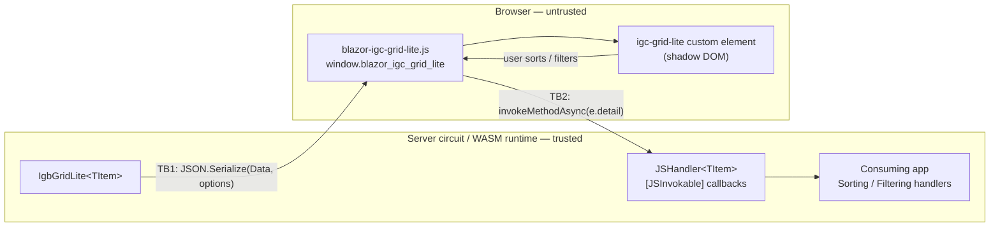

# Threat model — IgniteUI.Blazor.GridLite

| | |
|---|---|
| **Status** | Draft — awaiting maintainer review |
| **Package in scope** | `IgniteUI.Blazor.GridLite` (net8.0 / net9.0 / net10.0) |
| **Repository** | https://github.com/IgniteUI/IgniteUI.Blazor.GridLite |
| **Reviewed commit** | <!-- TODO(maintainer): SHA at time of sign-off --> |
| **Document owner** | <!-- TODO(maintainer): name --> |
| **Last updated** | 2026-08-11 |
| **Method** | STRIDE per trust-boundary, mapped to Microsoft's Blazor threat-mitigation guidance |

## 1. Why this document exists

Microsoft requires a maintained security/threat model and a completed security review
before a third-party Blazor component package can be endorsed alongside their own
components. This document is the threat model half of that requirement. It is a
**living document**: it is updated whenever the JS interop surface, the serialization
boundary, or the bundled third-party JavaScript changes.

It is not a penetration test, not an audit, and not an attestation of security.

## 2. Scope

**In scope**

- The `IgniteUI.Blazor.GridLite` NuGet package: managed code under `src/IgniteUI.Blazor.GridLite/`.
- The static web asset it ships: `wwwroot/js/blazor-igc-grid-lite.js` (Vite bundle of
  `igc-grid-lite-entry.js` + the `igniteui-grid-lite` npm package).
- The build and release pipeline that produces and signs the package.

**Out of scope**

- The consuming application (its authentication, authorization, CSP, data access).
- Internal implementation of the upstream `igniteui-grid-lite` npm package — treated as a
  trusted-but-verified dependency; its behaviour at the rendering boundary *is* in scope
  (see TM-DOM-01).
- The ASP.NET Core Blazor framework itself. Framework-level guarantees are treated as
  assumptions (§5) and are documented by Microsoft.
- The demo application under `demo/`.

## 3. Architecture and trust boundaries

Two boundaries carry all the risk:

- **TB1 — server → client.** Everything crossing it is visible to the end user, forever.
- **TB2 — client → server.** Everything crossing it is attacker-controlled and must be
  treated as untrusted input, exactly as Microsoft's guidance states: *"Treat any .NET
  method exposed to JavaScript as you would a public endpoint to the app."*

## 4. Assets and security objectives

| Asset | Objective |
|---|---|
| Consumer data bound to `Data` (`IEnumerable<TItem>`) | Confidentiality — only intended fields reach the browser |
| The Blazor circuit (server-side rendering) | Availability — a client cannot exhaust CPU/memory |
| The consuming app's browser origin | Integrity — the component never introduces script execution |
| The published NuGet package | Integrity — signed, reproducible, no unintended content |

## 5. Assumptions and consumer responsibilities

The model is only valid if these hold. They are stated so a reviewer can challenge them,
and they must be mirrored in consumer-facing documentation.

| # | Assumption |
|---|---|
| A1 | The consuming app enforces authentication/authorization; the grid performs none. |
| A2 | The consuming app enforces a Content Security Policy appropriate to its render mode. |
| A3 | The consuming app is free of XSS. Most TB2 threats below require attacker script in the page; per Microsoft's guidance an XSS-compromised client can already forge interop calls. The component's obligation is to avoid *causing* XSS and to avoid *widening* the blast radius. |
| A4 | Data bound to `Data` has already passed the app's own authorization filter. |
| A5 | `IgbGridLiteOptions.JavascriptPath` is a compile-time constant controlled by the app, never derived from user input or untrusted configuration. |
| A6 | Framework limits (`CircuitOptions`, `HubConnectionContextOptions.MaximumReceiveMessageSize`, JS interop call timeout) are left at or below their defaults. |

## 6. Threats

Severity is the residual severity **given** assumptions A1–A6. Status values: `Open`,
`Mitigated`, `By design`, `Accepted`, `Verified — no finding`.

### TB2 — client → server (JS interop callbacks)

| ID | Threat | STRIDE | Sev | Status |
|---|---|---|---|---|
| **TM-IX-01** | The `DotNetObjectReference` for `JSHandler<TItem>` is stored in a **global map** (`window.blazor_igc_grid_lite.dotNetRefs`), so any script in the page can retrieve it and invoke `JSSorting` / `JSSorted` / `JSFiltering` / `JSFiltered` with arbitrary payloads. Blazor itself does not expose instance refs globally — this exposure is introduced by the component's own JS. | S, T, E | Medium | **Open** |
| **TM-IX-02** | Untrusted `IgbGridLiteSortingExpression.FieldName` / filter operands flow into consumer `Sorting` / `Filtering` handlers. If the app forwards them into dynamic LINQ, SQL, or reflection, this becomes injection. | T, E | High *(consumer-facing)* | **Open** — needs documentation |
| **TM-IX-03** | Repeated or oversized callback invocation forces repeated `JsonSerializer.Deserialize` on the circuit. Bounded by SignalR message-size and framework limits (A6); unbounded in call *rate*. | D | Low | **Accepted** |
| **TM-IX-04** | All four callbacks wrap their body in `catch { }` with no logging. Malformed or hostile payloads are silently discarded, so tampering is undetectable and unauditable. | R | Medium | **Open** |
| **TM-IX-05** | Cell/row/data-view callbacks (`JSCellClick`, `JSRowClick`, `JSDataViewChanged`) are `[JSInvokable]` but have empty bodies — reachable dead surface. | E | Low | **Open** |

### TB1 — server → client (serialization and rendering)

| ID | Threat | STRIDE | Sev | Status |
|---|---|---|---|---|
| **TM-SER-01** | The **entire `TItem` object graph** is serialized to the browser, not only the fields bound to `IgbGridLiteColumn`. A consumer binding an ORM entity ships every property — including PII, internal flags and navigation properties — to the client. | I | High *(consumer-facing)* | **Open** — needs documentation |
| **TM-SER-02** | Under server-side prerendering the serialized component state is embedded in the initial HTML response and is subject to intermediary/browser caching. | I | Low | **Accepted** |
| **TM-DOM-01** | Whether the upstream `igniteui-grid-lite` renders cell values via `textContent` or `innerHTML` determines whether untrusted values in `Data` yield DOM XSS. This is *the* question a reviewer will ask of any grid. To resolve: confirm with the `igniteui-grid-lite` team whether any bound value reaches `innerHTML`, `insertAdjacentHTML` or a `lit-html` `unsafeHTML` directive, and record the answer plus the version it was verified against. | T | **To determine** | **Open** — must be answered before sign-off |
| **TM-DOM-02** | `AdditionalAttributes` (`CaptureUnmatchedValues`) is splatted onto the `<igc-grid-lite>` host element. Attacker-influenced dictionary contents become host attributes. | T | Low | **Open** |
| **TM-DOM-03** | `AdoptRootStyles` deliberately pierces shadow-DOM encapsulation by adopting document-level stylesheets, enabling CSS-based injection or exfiltration patterns against grid content. | I, T | Low | **By design** — opt-in, default `false` |
| **TM-IX-06** | `JSLoader` returns the result of `get_igc_grid_lite()`, which is **`window` itself**. The .NET side therefore holds an `IJSObjectReference` to the entire JS global object and invokes identifiers on it. Violates least privilege; a one-line fix. | E | Low | **Open** |
| — | Dynamic-import path injection via `Options.JavascriptPath`. Not reachable: the value is app-supplied and never derived from client input (A5). | — | — | **Accepted** — documented consumer responsibility |
| — | JS interop identifier injection. All identifiers passed to `InvokeVoidJsAsync` / `InvokeJsAsync` are hard-coded string literals. | — | — | **Verified — no finding** |
| — | `MarkupString` / `AddMarkupContent` / `eval` in first-party code. None present. | — | — | **Verified — no finding** |

### Supply chain, build and release

| ID | Threat | STRIDE | Sev | Status |
|---|---|---|---|---|
| **TM-SC-01** | `igniteui-grid-lite` is bundled *inside* the .nupkg. Consumers cannot patch an upstream JS CVE independently — they must wait for a GridLite release. Upstream CVEs are handled under the same disclosure SLAs as first-party reports: acknowledgement within 3 business days, triage within 7 business days, fix timeline by severity. Those SLAs are published in `SECURITY.md`, which this repository does not yet have (TM-PKG-01). | T | Medium | **By design** — SLA pending TM-PKG-01 |
| **TM-SC-02** | The dependency is pinned `~0.9.0` — a pre-1.0 range. Minor-version churn is expected and the upstream has no stated support policy. | T | Medium | **Open** |
| **TM-SC-03** | No SCA, CodeQL, dependency-review or secret-scanning gate. The repository has **no CI workflow at all** — only `publish.yml`. | — | High | **Open** |
| **TM-BLD-01** | In `publish.yml`, `actions/checkout`, `actions/setup-dotnet` and `actions/setup-node` are pinned to **mutable tags**, not commit SHAs. Only `azure/login` and `NuGet/login` are SHA-pinned. A compromised tag executes in a job holding `id-token: write`. | T, E | Medium | **Open** |
| **TM-BLD-02** | The MSBuild `EnsureNodeModules` target runs bare `npm install` (lockfile-bypassing) on local/dev builds. CI correctly uses `npm ci` with `-p:RunNodeBuild=false`, so released artifacts are unaffected. | T | Low | **Accepted** — dev-only divergence |
| **TM-BLD-03** | No `ContinuousIntegrationBuild`, SourceLink or deterministic-build properties, so the published package is not source-verifiable by consumers. | R | Low | **Open** |
| **TM-PKG-01** | No `SECURITY.md` and no private vulnerability reporting channel: a reporter's only route today is a public issue. | R | High | **Open** |

## 7. Existing controls

Controls already in place, verified in `.github/workflows/publish.yml` and the project files:

- **Release integrity** — Authenticode signing of all DLLs *with a post-sign verification
  gate*; NuGet package signing followed by `dotnet nuget verify`.
- **Credential hygiene** — Azure OIDC federation (no stored cloud credentials) and NuGet
  Trusted Publishing via short-lived OIDC-issued API keys (no long-lived `NUGET_API_KEY`).
- **Least privilege** — job-scoped `permissions: { id-token: write, contents: read }`;
  publishing gated behind the protected `NuGet Deploy` environment.
- **Reproducible dependency install** — `npm ci` against a committed `package-lock.json`.
- **Dependency updates** — Dependabot configured.
- **No unsafe primitives** — no `eval`, `new Function`, `MarkupString`, `AddMarkupContent`
  or `AllowUnsafeBlocks` in first-party code.

## 8. Residual risk

| ID | Accepted risk | Justification | Approver | Date |
|---|---|---|---|---|
| TM-IX-03 | Callback invocation rate is unbounded | Framework message-size and interop timeouts cap per-call cost; rate limiting belongs to the hosting app | <!-- TODO --> | |
| TM-SER-02 | Prerendered state in initial HTML | Inherent to Blazor SSR; mitigated by app-level cache headers | <!-- TODO --> | |
| TM-SC-01 | Bundled third-party JS | Required for a single-package consumer experience; offset by the published disclosure SLAs (3-day acknowledgement, 7-day triage, fix by severity) applying equally to upstream CVEs | <!-- TODO --> | |
| TM-BLD-02 | `npm install` on local builds | Released artifacts are built only in CI with `npm ci` | <!-- TODO --> | |

## 9. Review and sign-off log

| Version | Commit | Reviewers | Date | Open Critical/High | Outcome |
|---|---|---|---|---|---|
| <!-- TODO --> | | | | | |

Release gate: **no `Open` finding of severity High or above may ship.**

## 10. References

See [PR.md](../../PR.md#references) in the repository root.
