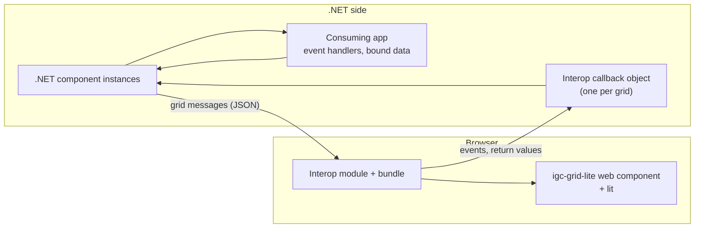

# Threat model — IgniteUI.Blazor.GridLite

This document explains where the trust boundaries of `IgniteUI.Blazor.GridLite` lie, what the library guarantees at each of them, and what remains the consuming application's responsibility. It builds on Microsoft's threat mitigation guidance for Blazor rather than repeating it; the [Threat mitigation](#4-threat-mitigation) section lists only what is specific to this library.

To report a suspected vulnerability, follow [`SECURITY.MD`](../../SECURITY.MD). Do not open a public issue.

## 1. Scope

**In scope**

- The managed library and the JavaScript it ships: the .NET component classes, the interop layer between them and the browser, and the bundled `igniteui-grid-lite` together with the `igniteui-webcomponents` and `lit` it depends on.
- The build and release pipelines that produce and sign the NuGet package.

**Out of scope**

- The consuming application, including its authentication, authorization, data access and Content Security Policy.
- The internals of `igniteui-grid-lite`, `igniteui-webcomponents` and `lit`. All are maintained outside this repository, the first two by Infragistics, and are not audited here. How this library uses them at the rendering boundary is in scope; the bundled versions are lockfile-pinned and covered by the dependency review and alerts described in [§6](#6-supply-chain-build-and-release).
- The ASP.NET Core Blazor framework. Its guarantees are assumed, not re-verified here.
- The demo application and the test projects.

## 2. How the library works

Every grid the application places in a Razor page is a **.NET component instance** that owns one **web component** in the browser: the `igc-grid-lite` element it renders, with its column definitions as child elements. The .NET side is the source of truth: parameter values and bound data flow to the browser as **grid messages**, one full message on the first render and a delta whenever a parameter changes, and the web component renders them. In the other direction the browser sends back the grid's sorting and filtering events, and the return value of the one method that queries the grid, its column configuration. Events enter .NET through an **interop callback object** created per grid and handed to the browser when the grid first renders. The library's interop module is imported from a fixed path in the package's static web assets after the first interactive render; it keeps its state in module scope and in turn imports the bundle that registers the web component.

```mermaid
flowchart LR
  subgraph NET[".NET side"]
    C[".NET component instances"]
    K["Interop callback object<br/>(one per grid)"]
    A["Consuming app<br/>event handlers, bound data"]
  end
  subgraph BR["Browser"]
    L["Interop module + bundle"]
    E["igc-grid-lite web component<br/>+ lit"]
  end
  A --> C
  C -- "grid messages (JSON)" --> L
  L -- "events, return values" --> K
  K --> C --> A
  L --> E
```

## 3. Trust boundaries by hosting model

Where the trust boundary sits depends entirely on how the application hosts Blazor. In a Blazor Web App these are per-component render modes and one page can mix them. The library ships the same code for every model, so this section is the key to reading the rest of the document.

| Hosting model          | Where .NET runs                                                                         | Boundary                                                                                                                                                                                                                                                         | What Microsoft's guidance says                                                                                                                                                                                                                                                        |
| ---------------------- | --------------------------------------------------------------------------------------- | ---------------------------------------------------------------------------------------------------------------------------------------------------------------------------------------------------------------------------------------------------------------- | ------------------------------------------------------------------------------------------------------------------------------------------------------------------------------------------------------------------------------------------------------------------------------------- |
| **Interactive Server** | On the server, inside a SignalR circuit                                                 | Browser → circuit. Every call from the library's JavaScript into the interop callback object is a call into the server.                                                                                                                                          | [Interactive server-side rendering](https://learn.microsoft.com/aspnet/core/blazor/security/interactive-server-side-rendering): _"Treat any .NET method exposed to JavaScript as you would a public endpoint to the app."_ Circuit and message-size limits bound resource exhaustion. |
| **WebAssembly**        | In the browser, same origin as the page script                                          | None inside the browser. The .NET runtime, the bundle and any attacker script share one origin on the user's machine; the security boundary is the application's own HTTP APIs. The origin sandbox and the CSP still bound what page script can do.              | Microsoft publishes no separate threat-mitigation article for WebAssembly, because nothing on the client is trusted. Standard client-side rules apply: no secrets in the app, all authorization on the server.                                                                        |
| **Auto**               | On the server on the first visit, in the browser once the WebAssembly runtime is cached | Either of the two above, and the application cannot predict which. Reason about data exposure as for WebAssembly and about inbound cost as for Interactive Server.                                                                                               | Both of the above, per the mode in effect.                                                                                                                                                                                                                                            |
| **Static SSR**         | On the server, once, with no interactivity                                              | Server → HTML. No interop ever runs and the library's JavaScript is never loaded, so the grid element stays an unrendered custom element. The grid emits its element, its column definitions and any additional attributes as encoded markup, and no bound data. | [Static server-side rendering](https://learn.microsoft.com/aspnet/core/blazor/security/static-server-side-rendering). For this library the only exposure is which column definitions and attributes appear in the page.                                                               |
| **Hybrid (WebView)**   | In a native process hosting a WebView                                                   | Browser → native process. The same interop surface as Interactive Server, but the callee has the privileges of the host application rather than of a web server.                                                                                                 | [Blazor Hybrid security considerations](https://learn.microsoft.com/aspnet/core/blazor/hybrid/security/security-considerations): treat the code inside the WebView as untrusted, and validate everything arriving from it, events and JS interop alike.                               |

In every interactive model, nothing crosses the outbound or inbound boundary until the component is interactive. Prerendered HTML carries only what static SSR would emit.

Three flows cross these boundaries:

- **Outbound: .NET → browser.** Grid messages. The concern is _confidentiality_: which data leaves the .NET side.
- **Inbound: browser → .NET.** Events through the interop callback object, and the column configuration returned to the one method that queries it. Under Interactive Server and Hybrid this is attacker-reachable input; the concern is _integrity_ and _availability_ of the .NET side.
- **Rendering: data → markup.** Bound values becoming DOM, on the server through Blazor's render tree and in the browser through the web component. The concern is _script injection_ into the application's origin.

## 4. Threat mitigation

The consuming application must first apply Microsoft's guidance for its hosting model. On top of that, the library guarantees the following properties.

### 4.1 Inbound interop

| Threat                                                                      | What the library does                                                                                                                                                                                                                                                                                                                                                                                                                                                                                                                                                                         |
| --------------------------------------------------------------------------- | --------------------------------------------------------------------------------------------------------------------------------------------------------------------------------------------------------------------------------------------------------------------------------------------------------------------------------------------------------------------------------------------------------------------------------------------------------------------------------------------------------------------------------------------------------------------------------------------- |
| A client forges a call targeting another user's components                  | Impossible under Interactive Server. The interop callback object is handed to the browser as a reference scoped to one circuit, because the framework binds a `DotNetObjectReference` to the circuit that issued it; there is one per grid and no shared registry on the .NET side to address. On WebAssembly and Hybrid there is one user per runtime and nothing to forge across.                                                                                                                                                                                                           |
| A client raises an event the application did not subscribe to               | Dropped. An event is dispatched only if the application bound the matching `EventCallback`; the interop module attaches a listener only for events that have one, and each callback returns before parsing when none is bound.                                                                                                                                                                                                                                                                                                                                                                |
| A client-supplied payload activates an arbitrary .NET type or executes code | Not possible. Payloads are parsed with source-generated `System.Text.Json` into types the library itself defines, with the object-typed filter `SearchTerm` read as a `string`, `double` or `bool`, or else kept as `JsonElement`; there is no polymorphic deserialization and no arbitrary type activation.                                                                                                                                                                                                                                                                                  |
| A client answers the column query with arbitrary content                    | Bounded to the column configuration type. The result is parsed through the same source-generated context, and anything that is not an array yields an empty result.                                                                                                                                                                                                                                                                                                                                                                                                                           |
| Resource exhaustion through interop floods or oversized payloads            | Bounded per payload and per connection, not per rate. `MaximumReceiveMessageSize` bounds each payload and `CircuitOptions` bounds retained circuits and unacknowledged render batches. The framework dispatches inbound invocations one at a time per connection, so one client's calls queue rather than interleave; each callback awaits the application's handler, whose work draws on shared server CPU and memory, and the library keeps no per-call state on the .NET side. Neither the framework nor the library caps the call rate; see [§5](#5-guidance-for-application-developers). |

What remains after these guarantees is the same kind of risk as for a plain Blazor `@onclick`: a compromised client can fire a handler the application wired up, with arguments of the shape the application expects, and can answer the column query with a value of its choosing. The column keys, filter conditions and search terms in a sorting or filtering expression are browser-supplied strings and JSON values. Nothing in an inbound payload identifies a user. Audit at the handler, from the circuit's authenticated identity. See [§5](#5-guidance-for-application-developers).

### 4.2 Rendering

| Threat                                              | What the library does                                                                                                                                                                                                                                                                         |
| --------------------------------------------------- | --------------------------------------------------------------------------------------------------------------------------------------------------------------------------------------------------------------------------------------------------------------------------------------------- |
| A bound value is interpreted as HTML on the server  | Never. Server-side markup is plain Razor, which encodes; there is no `AddMarkupContent`, and bound values are never wrapped in `MarkupString`.                                                                                                                                                |
| A bound value is interpreted as HTML in the browser | Never through the library's own rendering. The interop module parses grid messages with `JSON.parse` and writes no markup itself. Bound values reach the web component as property assignments; how a web component renders its properties belongs to `igniteui-grid-lite` ([§1](#1-scope)).  |
| Dynamic code in the bundle requires `unsafe-eval`   | Not required. The library's JavaScript contains no `eval` or `new Function`; the interop module ships as written, and the bundled web component build is a minified ES module with source maps only in development builds. Applications can run the bundle under a CSP without `unsafe-eval`. |

Content the application renders _inside_ a component is the application's own code and is subject to the same rules as anywhere else in the app. Today that is only the column components: the library exposes no templates and no script parameters.

### 4.3 Outbound data

| Threat                                                  | What the library does                                                                                                                                                                                                                                                                                                                                                                                                                                                                |
| ------------------------------------------------------- | ------------------------------------------------------------------------------------------------------------------------------------------------------------------------------------------------------------------------------------------------------------------------------------------------------------------------------------------------------------------------------------------------------------------------------------------------------------------------------------ |
| Bound data reaches the browser beyond what is displayed | The grid serializes the **public properties** of the bound item type, not only the members its columns show, and every item in the bound collection whether or not it is in view. The transfer happens once the component is interactive; static SSR and prerendered HTML carry no bound data ([§3](#3-trust-boundaries-by-hosting-model)). Narrow the type and the collection before binding; see _Bind projections, not entities_ in [§5](#5-guidance-for-application-developers). |
| Interop payloads appear in logs                         | The managed library logs no event arguments, grid messages or bound values, and writes nothing to the console. A handler that throws is reported to the browser as a rejected interop promise, so the failure shows in the developer console.                                                                                                                                                                                                                                        |

## 5. Guidance for application developers

Everything else on Microsoft's pages, including CSRF, click-jacking, WebSocket compression side channels and open redirects, applies to the application unchanged and is not repeated here.

- **Treat event arguments and method return values as user input.** Anything a handler receives from a component event, and anything a component method returns, is read from the browser. Validate it as you would a form post before acting on it, and never derive authorization from it.
- **Never forward an expression into a query unvalidated.** A filter's `Key`, `Condition` and `SearchTerm` and a sort's `Key` are browser-supplied. An application that turns them into a database query or a dynamic expression must map the key to a known column and validate the value first.
- **Bind projections, not entities.** Every public property of a bound item type, and every item in the collection, is serialized to the browser once the component is interactive. Map to a view model that holds only what the grid shows, and page or filter the collection on the server before binding it.
- **Authorize before binding.** Components perform no authentication or authorization. Data handed to a component has already passed the application's filters.
- **Under Interactive Server, size the circuit limits deliberately.** `MaximumReceiveMessageSize` on the hub and the retention and buffering limits in `CircuitOptions` bound what one client can hold on the server. Leave them at their defaults unless measured payloads require otherwise, test the result as Microsoft's guidance describes, and limit connections per user at the application or gateway level. Neither the framework nor the library rate-limits inbound callbacks.
- **Apply a Content Security Policy.** A CSP and an XSS-free application keep other people's script out of the page. They are defence in depth, not a guarantee, and they do not constrain a user who controls their own browser; the guarantees in [§4.1](#41-inbound-interop) and the first item above cover that case. The library runs without `unsafe-eval`. Load third-party scripts only from origins the policy allows, with Subresource Integrity where possible, following [Microsoft's Blazor CSP guidance](https://learn.microsoft.com/aspnet/core/blazor/security/content-security-policy).
- **In Hybrid apps, treat WebView content as untrusted.** The interop callback object has the privileges of the host process; validate everything arriving from the WebView, as Microsoft's Hybrid security considerations describe. Everything you bind is serialized into the WebView, which must not hold credentials, tokens or sensitive user data.

## 6. Supply chain, build and release

- **Static analysis** — GitHub CodeQL code scanning (default setup) analyses C# and JavaScript/TypeScript on pushes and pull requests. Secret scanning with push protection and Private Vulnerability Reporting are enabled on the repository.
- **Dependency alerts** — GitHub Dependabot alerts and security updates cover the NuGet, npm and GitHub Actions manifests; version updates are configured for GitHub Actions with a 14-day cooldown and security updates fast-tracked. Pull requests additionally run a dependency review that fails on a new dependency with a known high-severity vulnerability, and release builds run an advisory NuGet and npm vulnerability scan whose report is attached to the release.
- **Release integrity** — Authenticode signing of all DLLs followed by a signature validation gate; NuGet package signing followed by `dotnet nuget verify`. Assemblies are also strong-named with a key materialised only for the build step and deleted afterwards, both signals are validated again on the packed bytes, and the package digest is recorded once and re-checked by every downstream job before it acts on the package.
- **Provenance** — the release produces SPDX and CycloneDX SBOMs and attests build provenance and both SBOMs against the signed package.
- **Credential hygiene** — Azure OIDC federation and NuGet Trusted Publishing with short-lived OIDC-issued keys; no long-lived publish secrets.
- **Least privilege and pinning** — workflow-level `contents: read` or no permissions by default, `id-token: write` and `attestations: write` granted per job, `contents: write` only on the job that attaches release evidence, checkouts without persisted credentials, signing, packing and publishing gated behind the `NuGet Deploy` environment, release actions pinned to commit SHAs.
- **Reproducible inputs** — `npm ci` without package-manager caching in release builds, `<Deterministic>true</Deterministic>` with `ContinuousIntegrationBuild` for release, central package version management. The bundled JavaScript dependencies' licences ship in the package as `THIRD-PARTY-LICENSES.md`.
- **Compiler safety** — the library compiles with `Nullable` enabled and every warning as an error, and is trim-compatible with the trim, AOT and single-file analyzers warning-free ([docs/TRIMMING.md](../TRIMMING.md)). It contains no `unsafe` code.
- **Testing** — bUnit unit tests on every target framework and Playwright integration tests, including a trimmed WebAssembly publish exercised in the browser, run in CI; a manual workflow repeats the browser checks against an AOT-compiled publish.

## 7. Reporting and disclosure

Suspected vulnerabilities are reported privately as described in [`SECURITY.MD`](../../SECURITY.MD), which also states the acknowledgement and triage timelines. Fixes are communicated through the channels `SECURITY.MD` lists, a GitHub Security Advisory or release notes, as the severity warrants. Findings that require action by application developers are added to [§5](#5-guidance-for-application-developers).

## 8. References

- [`SECURITY.MD`](../../SECURITY.MD) — vulnerability reporting and disclosure policy.
- [Threat mitigation guidance for ASP.NET Core Blazor interactive server-side rendering](https://learn.microsoft.com/aspnet/core/blazor/security/interactive-server-side-rendering)
- [Threat mitigation guidance for ASP.NET Core Blazor static server-side rendering](https://learn.microsoft.com/aspnet/core/blazor/security/static-server-side-rendering)
- [ASP.NET Core Blazor Hybrid security considerations](https://learn.microsoft.com/aspnet/core/blazor/hybrid/security/security-considerations)
- [Enforce a Content Security Policy for ASP.NET Core Blazor](https://learn.microsoft.com/aspnet/core/blazor/security/content-security-policy)
- [ASP.NET Core Blazor authentication and authorization](https://learn.microsoft.com/aspnet/core/blazor/security/)
- [Prevent cross-site scripting (XSS) in ASP.NET Core](https://learn.microsoft.com/aspnet/core/security/cross-site-scripting)
- [Microsoft Security Development Lifecycle: threat modeling](https://www.microsoft.com/en-us/securityengineering/sdl/threatmodeling)
